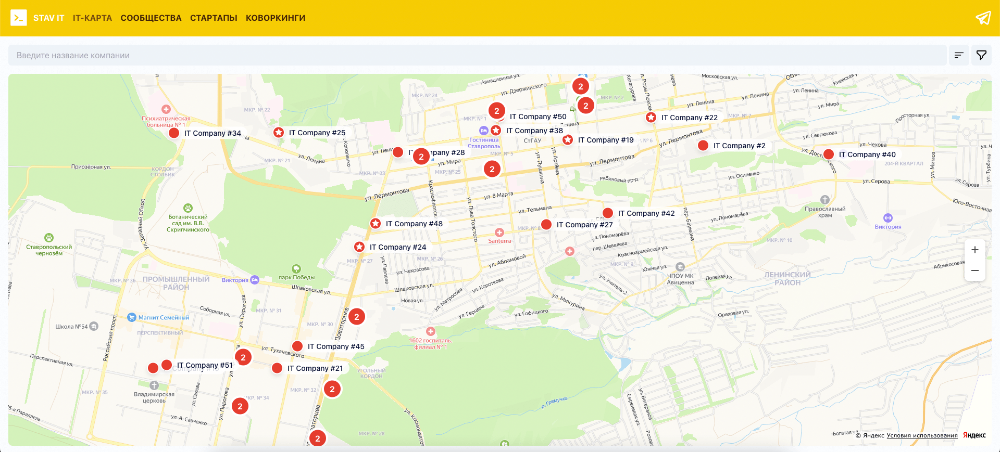

# IT-Сообщество Ставрополя

Добро пожаловать в IT-сообщество Ставрополя. Узнайте о местных IT компаниях, стартапах, коворкингах и сообществе.

## Disclaimer

Данный проект создан исключительно в <b>информационных целях</b> и содержит данные из <b>открытых источников</b>.
Мы не можем гарантировать точность или актуальность предоставленной информации.
Сайт не преследует коммерческих целей и предназначен для айти-специалистов — как местных, так и тех,
кто планирует переезд в Ставрополь.

##  Demo

[Web demo](https://stv-tech.ru/)



## Setting Up

### Install

* Node.js (v20.14.0 or higher)
* NPM (v10.7.0 or higher)

### Then locally

```
$ npm install
$ npm run dev
```

### Then on production

```
$ npm install
$ npm run build
```

## Developed By

Dmitry Kologrivko  - <dmitrykologrivko@gmail.com>
